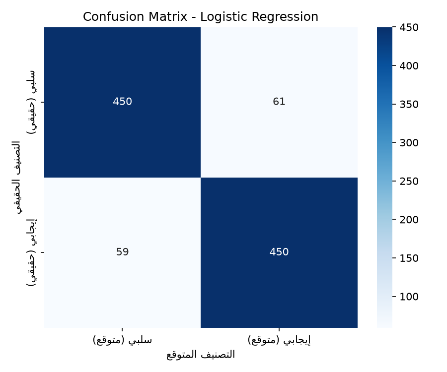
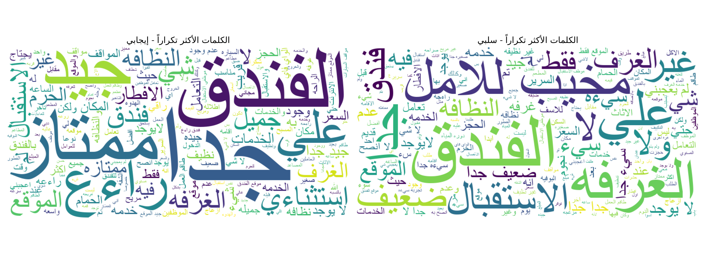

# Arabic Sentiment Analysis 🏨

A machine learning project that classifies Arabic hotel reviews as **positive** or **negative** using Natural Language Processing (NLP) techniques.

## 📋 Overview

This project applies sentiment analysis to Arabic text — a domain with far fewer resources and tools compared to English NLP. Using a dataset of ~2,000 Arabic hotel reviews, the model classifies each review's sentiment with **89.9% accuracy**.

## 🎯 Objectives

- Practice core Data Science fundamentals: data cleaning, feature engineering, model training and evaluation
- Explore Arabic NLP challenges (diacritics, letter normalization, dialectal variation)
- Build a portfolio project addressing a gap in Arabic-language ML resources

## 📊 Dataset

- **Source**: HARD (Hotel Arabic Reviews Dataset) — reviews collected from Booking.com
- **Size**: 1,020 training samples, 1,020 test samples
- **Labels**: Converted from 5-star ratings to binary sentiment (0 = negative, 1 = positive)
- **Class balance**: 511 negative / 509 positive (near-perfect balance)

## 🧹 Preprocessing Pipeline

1. Removed punctuation, numbers, and non-Arabic characters
2. Stripped Arabic diacritics (tashkeel)
3. Normalized letter variants (أ/إ/آ → ا, ى → ي, ة → ه, etc.)
4. Removed Arabic stop words — **while preserving negation words** (لا، لم، لن) critical for sentiment meaning
5. Converted text to numerical features using **TF-IDF** (3,000 features)

## 🤖 Models Compared

| Model | Accuracy |
|-------|----------|
| **Logistic Regression** | **89.90%** ✅ |
| Linear SVM | 88.24% |
| Naive Bayes | 87.55% |
| Random Forest | 87.16% |

Logistic Regression was selected as the final model.

## ✅ Validation

5-fold cross-validation confirmed model stability:
- **Mean accuracy**: 89.80%
- **Standard deviation**: 1.71%

## 📈 Results

**Classification Report:**

| | Precision | Recall | F1-score |
|---|-----------|--------|----------|
| Negative | 0.91 | 0.89 | 0.90 |
| Positive | 0.89 | 0.91 | 0.90 |

**Confusion Matrix:**



**Word Clouds (Positive vs Negative reviews):**



## 🛠️ Tech Stack

- Python 3.12
- pandas, numpy
- scikit-learn
- matplotlib, seaborn
- arabic-reshaper, python-bidi
- wordcloud

## 🚀 How to Run

```bash
pip install -r requirements.txt
jupyter notebook notebooks/sentiment_analysis.ipynb
```

## 💡 Key Learnings

- N-gram features (bigrams) did not improve performance on this dataset size — a reminder that added complexity doesn't always help with smaller datasets
- Preserving negation words in stop-word removal is critical for sentiment tasks
- Simple linear models (Logistic Regression) can outperform more complex models (Random Forest) on small, high-dimensional TF-IDF data

## 👤 Author

**Leen** — Photographer & Data Science student
[LinkedIn](www.linkedin.com/in/leen-alhlwane-63a379214) |
 [GitHub](https://github.com/Leenhl97)